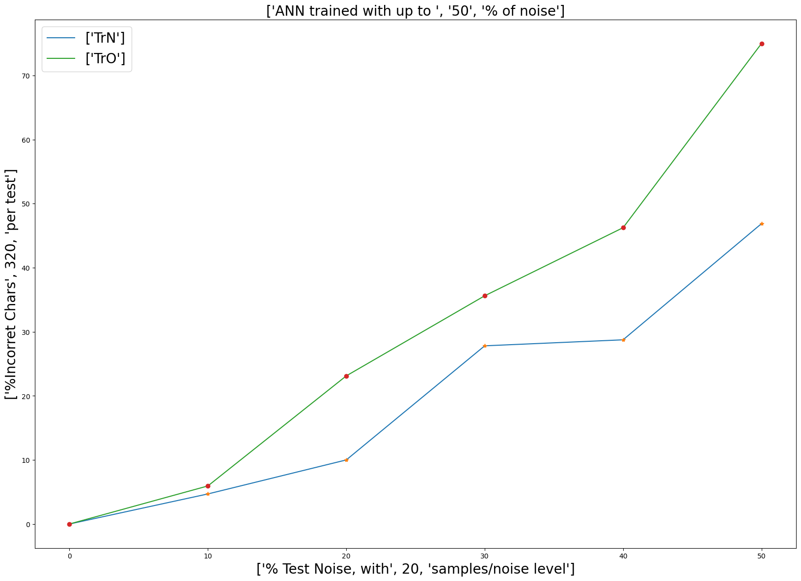

# Reconhecimento de Caracteres com Melhoria da Tolerância a Ruídos

## resumo

Este trabalho investiga o impacto do ruído nas entradas durante o treinamento de redes neurais para classificação. O ruído nas entradas é uma ocorrência comum em muitos cenários do mundo real, e compreender como ele afeta o desempenho das redes neurais é crucial para melhorar sua robustez e generalização. Através de experimentos em um conjunto de dados com diferentes níveis de ruído, comparou-se o desempenho de modelos treinados com e sem ruído. Os resultados mostram que modelos treinados com ruído têm melhor capacidade de generalização e classificam amostras com ruído com maior precisão. Sugere-se o uso de técnicas de regularização para melhorar a robustez das redes neurais em relação ao ruído nas entradas. O estudo contribui para o desenvolvimento de modelos mais eficazes para dados com ruídos.

## Introdução

Redes neurais multicamadas feedforward têm sido amplamente utilizadas em diversas aplicações de aprendizado de máquina, incluindo tarefas de classificação. Essas redes apresentam uma arquitetura em camadas, onde as informações fluem apenas em uma direção, da camada de entrada até a camada de saída. Comumente, são empregadas técnicas de aprendizado supervisionado para treinar essas redes, ajustando os pesos sinápticos de modo a minimizar uma função de custo.

No entanto, na prática, muitos ambientes e conjuntos de dados apresentam ruído nas entradas, o que pode afetar o desempenho dessas redes neurais. O ruído nas entradas pode ser originado de diversas fontes, como sensores imprecisos, erros de medição ou informações incompletas. Compreender como a presença desse ruído influencia o treinamento e a capacidade de generalização das redes neurais é essencial para aprimorar sua robustez em ambientes reais.

O objetivo deste estudo é investigar e comparar o treinamento de classificação utilizando redes neurais multicamadas feedforward com e sem ruído nas entradas. Para isso, serão conduzidos experimentos utilizando conjuntos de dados representativos, compostos por amostras com e sem ruído. Serão analisados diferentes níveis e tipos de ruído introduzidos nas entradas, a fim de avaliar seu impacto no desempenho dos modelos treinados.

A compreensão dos efeitos do ruído nas entradas durante o treinamento de redes neurais multicamadas feedforward é fundamental para o desenvolvimento de estratégias que melhorem sua capacidade de generalização e robustez em cenários com presença de ruído. Esse trabalho busca contribuir para o avanço do conhecimento na área de aprendizado de máquina, processamento de sinais e visão computacional.

Nesse presente experimento redes neurais artificiais serão treinadas para reconhecer uma matriz de pixeis binários, de forma análoga a um sistema de OCR (“Optical Character Recognition”). Cada imagem adquirida pelo sistema deve ser associada a um caractere de um alfabeto de caracteres válidos e é considerado um caractere com ruído aquele que alguns bits são invertidos aleatoriamente.

É natural que com caracteres ruidosos os resultados obtidos não tenham uma alta precisão. Nesse sentido além de avaliar o impacto do ruído deseja-se melhorar a capacidade da rede neural de lidar com caracteres ruidosos com o treinamento especifico para esse fim. Ao final os resultados serão comparados 

## Metodologia
 
### Dados a serem estudados

Nesse experimento nosso alfabeto de dados é composto por 16 caracteres, de dimensão 7x9, ou seja, a rede neural terá 63 entradas, que é a dimensão da imagem gerada. As imagens serão geradas por meio de uma matriz binária, e o alfabeto pode ser visto na figura. Já as entradas com ruídos serão obtidas a partir das entradas sem ruídos e serão aplicadas aleatoriamente mudanças dos estados de posições da matriz de acordo com a quantidade de ruído pedida, ou seja, com o ruído em 10%, até 10% das posições da matriz podem ter seus valores trocados, onde era 1 se torna 0 e vice-versa. Um exemplo de caracteres com 10% de ruído pode ser visualizado na figura.

# Estrutura da Rede Neural
A rede neural multicamada feedforward foi construída com uma lógica densa, ou seja, todos os neurônicos da camada anterior se conectam em todos os neurônios da camada seguinte. Na configuração foram criadas duas camadas ocultas, uma cada de entrada e uma camada de saída, onde temos a seguinte configuração nas camadas:

* Camada de entrada:
    * Neurônios: 63
* Primeira camada oculta: 
    * Neurônios: 32
    * Função de ativação: sigmoid(x) = 1 / (1 + exp(-x))
    * Inicializador: (Uniforme) Inicializador que gera tensores com distribuição uniforme
* Segunda camada oculta: 
    * Neurônios: 24
    * Função de ativação: sigmoid(x) = 1 / (1 + exp(-x))
    * Inicializador: (Uniform) Inicializador que gera tensores com distribuição uniforme
* Camada de saída: 
    * Neurônios: 16
    * Função de ativação: sigmoid(x) = 1 / (1 + exp(-x))
    * Inicializador: Uniforme (Inicializador que gera tensores com distribuição uniforme)
O compilador foi realizado da seguinte forma:

* Função de perda: (binary crossentropy) entropia cruzada para aplicações de classificação binária (0 ou 1)
* Otimizador: (adam) É um método de descida de gradiente estocástico baseado na estimativa adaptativa de momentos de primeira e segunda ordem
* Métrica: (accuracy) Calcula com que frequência as previsões são iguais aos rótulo

### Método de treinamento
A estrutura do modelo da rede neural será um array com 6 posições, onde cada posição representará uma rede neural com as mesmas configurações apresentadas porém herdando o treinamento da posição anterior do array de modelos. De forma que a posição 0 do array terá um treinamento e a posição 1 irá herdar esse treinamento e será treinada em cima dos pesos já encontrados.

Dessa forma o modelo da RNA terá um treinamento completo na posição 0 com os dados sem ruídos para que a acurácia seja de 100\% e as posições seguintes terão um treinamento especializado com níveis de ruído dependendo da posição. A ideia é treinar as posições do array com níveis de ruído e manter o treinamento anterior onde já existe uma precisão nos resultados.

#### Treinamento da rede sem ruído

Nesse treinamento é preciso encontrar um bom resultado sem erro, para que a comparação com os demais níveis de ruído revele realmente o quanto a rede não consegue identificar. Por isso para esse treinamento a rede utilizou 3 mil épocas e com um batch size de 1. 

#### Treinamento da rede com ruído

Para as demais redes neurais com ruídos essas foram treinadas com conjuntos de caracteres ruidosos diferentes entre si 10 vezes. De forma simples, para uma rede neural treinada com ruído foram gerados 10 conjuntos de caracteres ruidosos diferentes entre si e esses foram treinados com um número de épocas igual a 30 e um batch size de 1. Após esse treinamento foi realizado um treinamento com a rede neural com caracteres sem ruído para a rede não "esquecer" dos valores sem ruído, esse treinamento foi realizado com 200 épocas.

Esse processo foi realizado para 5 redes neurais treinadas com ruído em que respectivamente tiveram os seguintes níveis de ruído: 10\%, 20\%, 30\%, 40\% e 50\% de ruído. Lembrando que os pesos gerados nos treinamentos anteriores serviram como base para os próximos treinamentos

### Método de obtenção de resultados

Para os resultados do experimento todas as 6 redes foram testadas cada uma com 20 conjuntos de alfabeto como entradas. A rede neural treinada sem ruído foi submetida a validação de todos os 6 níveis de ruídos existentes no experimento. A segunda rede neural testada é um conjunto das outras 5 redes treinadas com ruído, cada rede foi testada com o nível de ruído que foi treinada no mesmo escopo do treinamento sem ruído, onde 20 conjuntos de alfabetos foram geradas e testados

As curvas geradas pelas validações das redes neurais podem ser vistas nas figuras \ref{fim} e \ref{fim2}, nessa figura podemos ver o comportamento das duas redes em relação ao nível de ruído e o seu percentual de erro em cada nível. A curva verde mostra os resultados da rede neural sem o treinamento com ruídos e a curva azul mostra o resultado da rede ao ser treinada com ruído. 

## Resultados e Conclusões

Neste experimento, investigamos o impacto do ruído nas entradas durante o treinamento de redes neurais multicamadas feedforward para tarefas de classificação. Por meio de experimentos comparativos, foi possível observar os efeitos do ruído nas métricas de desempenho dos modelos treinados.

Nossos resultados demonstraram que a presença de ruído nas entradas durante o treinamento teve um impacto significativo no desempenho das redes neurais. Em geral, os modelos treinados com ruído mostraram uma capacidade de generalização superior, obtendo melhor acurácia na classificação de amostras com ruído em comparação aos modelos treinados sem a presença desse ruído. Esses achados reforçam a importância de considerar o ruído como um fator relevante no treinamento de redes neurais para obter modelos mais robustos.

Além disso, observamos que diferentes tipos e níveis de ruído podem afetar de maneira distinta o desempenho das redes neurais. Essa descoberta ressalta a necessidade de uma análise cuidadosa do ruído presente no ambiente específico em que as redes neurais serão aplicadas, a fim de adaptar adequadamente o treinamento e otimizar seu desempenho.

Em resumo, este estudo fornece insights valiosos sobre o treinamento de redes neurais multicamadas feedforward com ruído nas entradas. Os resultados obtidos destacam a importância de considerar o ruído como um fator crítico durante o treinamento de redes neurais para obter modelos mais robustos e com melhor capacidade de generalização.
